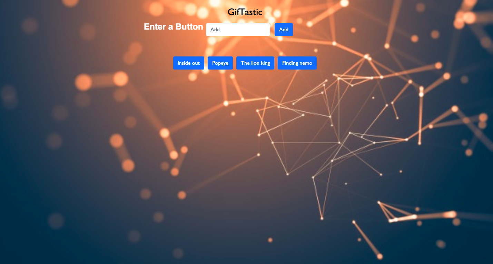

# GifTastic

## Some Useful resources that help me to buid this portfolio
*  Javascript -- Game Logic Code
*  Jquery -- Game Logic Code
*  HTML  -- Show the game output on browser 
*  CSS -- custom display effects of the game
*  Bootstrap -- code optimization
*  API -- Application Programming Interface
*  Ajax -- Asynchronous Javscript XML

 ## Description
  How Game works:- 

* Click On button to create new Button
* Click on Gif to stop and again click to restart animation

## Click on the following link to deployed site
[GifTastic]( https://minalk24.github.io/GifTastic/)

 ## Images 

## Author
Minal Kharche
